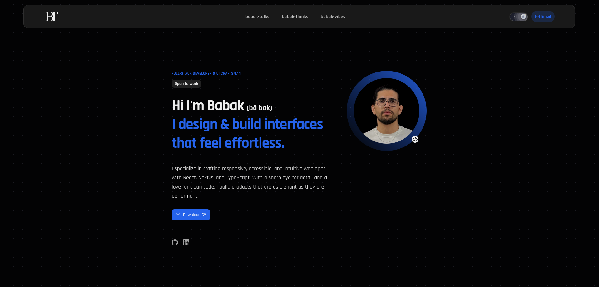

# 👨‍💻 Babak Taghizadeh – Developer Portfolio

Welcome to the codebase of [babakcreates.com](https://babakcreates.com) — my personal digital space. This portfolio showcases who I am as a developer, how I think, and what I’ve built. It also includes a blog to document and share what I’m learning along the way.



---

## 🔗 Live Site

🌍 [https://babakcreates.com](https://babakcreates.com)

---

## 🧰 Tech Stack

This project is built with a modern and scalable front-end stack:

- **Next.js (App Router)** – for SSR, routing, and performance
- **TypeScript** – for type safety and better DX
- **Tailwind CSS** – for rapid, utility-first styling
- **Shadcn/UI** – for consistent, accessible UI components
- **Framer Motion** – for smooth page transitions and animations
- **Sanity CMS** – for managing blog content

---

## 💡 Purpose

I built this portfolio to:

- Share my background, values, and technical focus
- Document and publish articles on self-growth and development
- Present my front-end architecture and UI design capabilities
- Make a lasting first impression for job applications and networking

---

## ✨ Features

- ✅ Clean, responsive, and accessible layout
- ✅ Dynamic blog powered by Sanity.io
- ✅ Animated transitions for smooth UX
- ✅ Reusable components and design system via Shadcn
- ✅ SEO-optimized with metadata and structured content
- ✅ Deployed and production-ready

---

## 🚀 Getting Started (Development)

To run this project locally:

```bash
git clone https://github.com/Babak-Taghizadeh/babak-creates-portfolio.git
cd portfolio
npm install
npm run dev
